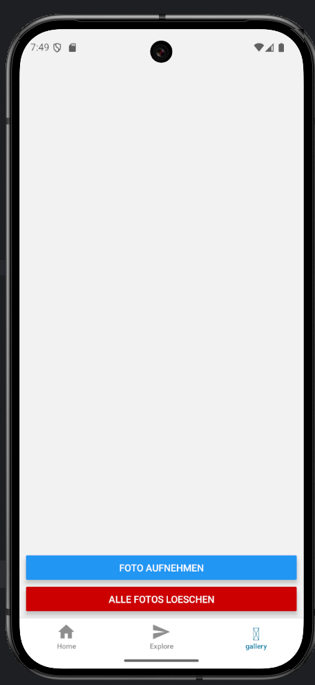
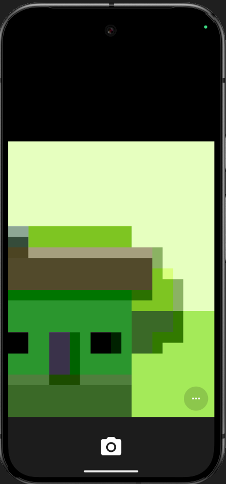
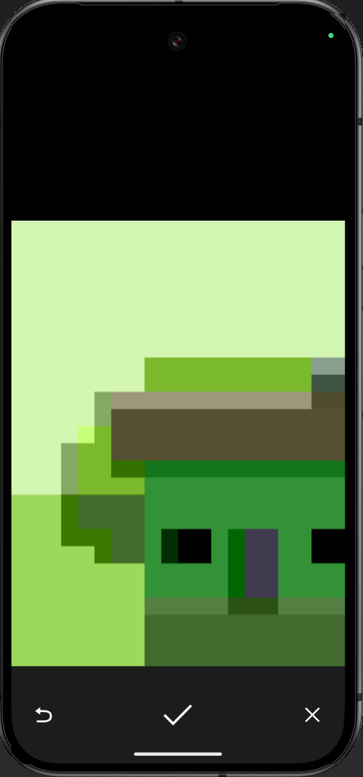
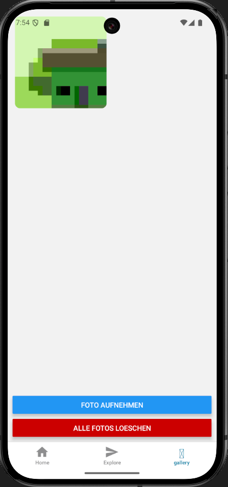
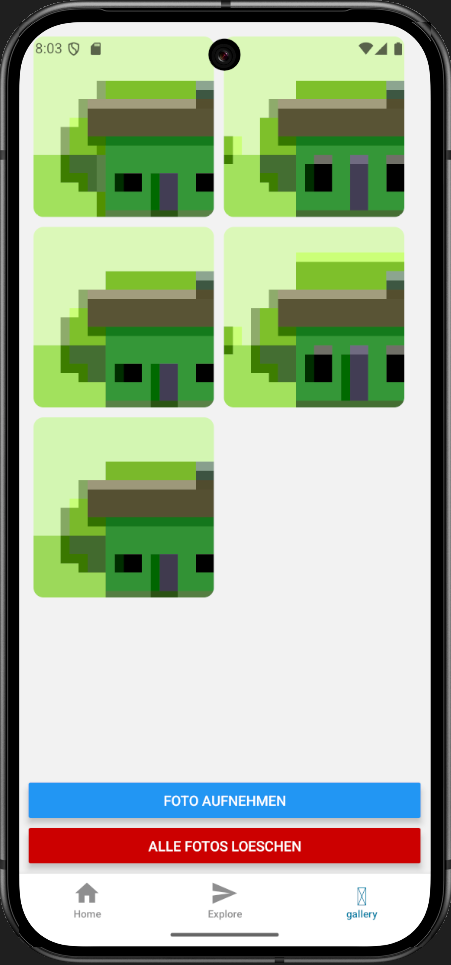
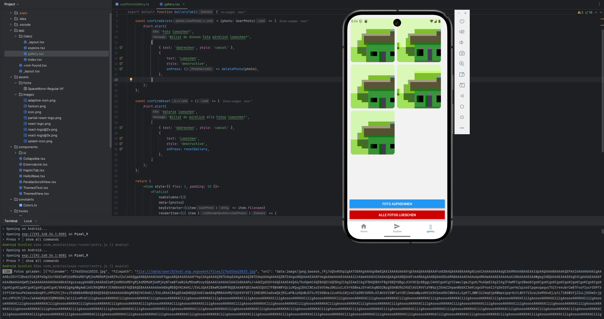
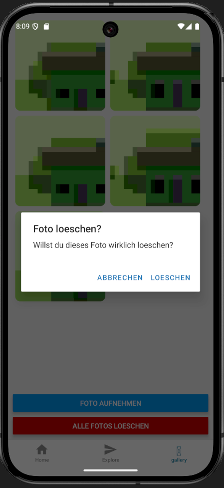
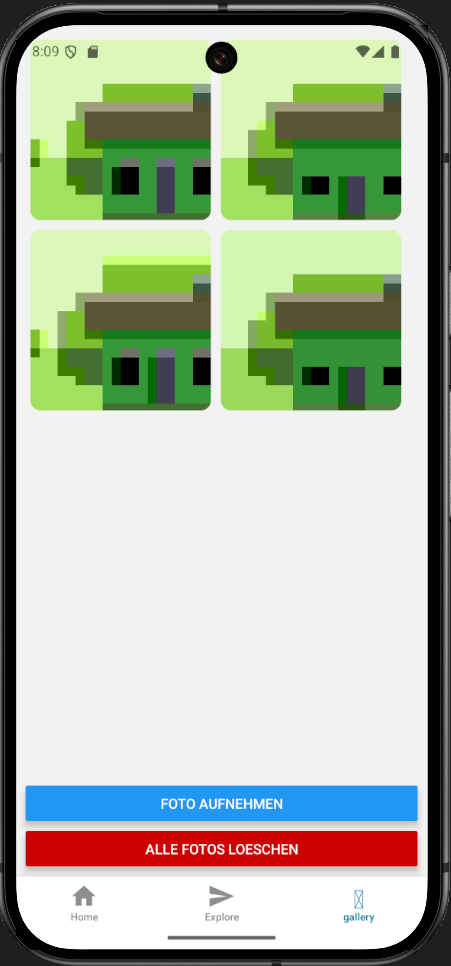

# Protokoll zu Aufgabe Ionic Tutorial [Freiwillig] 

**Viktor Novak** \
**06.05.2025** 

---

Es war keine Checkliste vorgegeben, also hab ich eigene Punkte erstellt

## Auflistung aller Punkte aus der Checkliste:

- Foto mit der Kamera aufnehmen  
- Foto lokal speichern im Dateisystem mit `expo-file-system`  
- Galerie-Ansicht mit FlatList im Grid  
- Anzeige gespeicherter Fotos beim Neustart also Persistenz  
- Fotos können durch Long-Press gelöscht werden  


## Folgende Punkte wurden erfüllt:

- Foto mit der Kamera aufnehmen  
- Foto lokal speichern im Dateisystem mit `expo-file-system`  
- Galerie-Ansicht mit FlatList im Grid  
- Anzeige gespeicherter Fotos beim Neustart also Persistenz  
- Fotos können durch Long-Press gelöscht werden  


## Techstack

Ich wollte mir selber mal **React Native anschauen/beibringen**, weil es auch wahrscheinlich privat einen Nutzen haben wird und es mich einfach interessiert hat.

Also habe ich mit **React Native gearbeitet** und zum Testen der App **Android Studio** heruntergeladen, um es auf einem Android-Handy zu testen.

---

### Foto mit der Kamera aufnehmen

**1. Auf den Gallery tab gehen**




**2. Auf den "Foto aufnehmen" Button drücken und ein Foto machen**

 \


**3. Das geschossene Foto wird in der Gallerie UI angezeigt**



Die Kamera wird über `expo-image-picker` geöffnet. Nach Bestätigung wird das Bild im lokalen `documentDirectory` gespeichert. Danach wird es in `base64` konvertiert und direkt im UI angezeigt.

**Fehler & Behebung:**

- Fehler: Kamerazugriff nicht erlaubt  
- Lösung: Abfrage mit `requestCameraPermissionsAsync()`

**Relevanter Code – `usePhotoGallery.ts`:**

```ts
const result = await ImagePicker.launchCameraAsync(...);
const fileName = Date.now().toString() + '.jpg';
await FileSystem.copyAsync({ from: uri, to: newPath });

const base64 = await FileSystem.readAsStringAsync(newPath, {
  encoding: FileSystem.EncodingType.Base64,
});

const savedPhoto = {
  uri: `data:image/jpeg;base64,${base64}`,
  filepath: newPath,
  filename: fileName,
};
```

---

### Foto lokal speichern im Dateisystem mit expo-file-system

**Zustand nach erfolgreichem Speichern:**


**Beschreibung der Implementierung:**

Die Datei wird nach dem Fotografieren mit `copyAsync` in den App-internen Speicher gecopied. Alle Bilder werden als json (`photos.json`) gespeichert.

**Fehler & Behebung:**

- Fehler: Bild wird gespeichert, aber nicht mehr lesbar beim Neustart  
- Lösung: statt `file://`, wird `base64` verwendet und Pfad separat gespeichert

**Relevanter Code – `savePhotos()` + JSON-Speicherung:**

```ts
const savePhotos = async (photos: UserPhoto[]) => {
  const json = JSON.stringify(photos);
  await FileSystem.writeAsStringAsync(FileSystem.documentDirectory + 'photos.json', json);
};
```

---


### Galerie-Ansicht mit FlatList im Grid

**Zustand mit mehreren Bildern in Grid-Ansicht:**



**Beschreibung der Implementierung:**

Die Galerie benutzt `FlatList` mit `numColumns={2}`. Jedes Bild wird als `Image` in einem `Pressable` dargestellt, damit das Long-Press funktioniert.

**Fehler & Behebung:**

- UI zeigt Bilder nicht an  
- Ursache: `file://`-URIs waren im UI nicht sichtbar  
- Lösung: `base64` verwenden

**Relevanter Code – `gallery.tsx`:**

```tsx
<FlatList
  numColumns={2}
  data={photos}
  keyExtractor={(item) => item.filename}
  renderItem={({ item }) => (
    <Pressable onLongPress={() => confirmDelete(item)}>
      <Image
        source={{ uri: item.uri }}
        style={{ width: 180, height: 180, margin: 5, borderRadius: 10 }}
      />
    </Pressable>
  )}
/>
```

---

### Anzeige gespeicherter Fotos beim Neustart

**Zustand nach App-Neustart mit geladenen Bildern:**




**Beschreibung der Implementierung:**

Beim Laden der App wird `photos.json` eingelesen, alle `filepath`-Dateien geprüft und als `base64` wieder geladen, wie man in der console sehen kann.

**Fehler & Behebung:**

- Crash durch alte Müll Daten deshalb: `getInfoAsync(null)` bei alten JSON-Daten  
- Lösung: Check auf `photo.filepath` eingebaut + Reset-Funktion ergänzt

**Relevanter Code – `loadSavedPhotos()`**

```ts
for (const photo of parsed) {
  if (!photo.filepath) continue;
  const fileCheck = await FileSystem.getInfoAsync(photo.filepath);
  if (fileCheck.exists) {
    const base64 = await FileSystem.readAsStringAsync(photo.filepath, {
      encoding: FileSystem.EncodingType.Base64,
    });
    ...
  }
}
```

---

### Fotos können durch Long-Press gelöscht werden

**Zustand mit Löschdialog nach Long-Press:**

 \


**Beschreibung der Implementierung:**

Ein `Pressable`-Element reagiert auf `onLongPress` und öffnet ein `Alert`. Nach der User auf löschen drückt wird das Bild mit `FileSystem.deleteAsync()` gelöscht.

Der "Der Alle Fotos Loeschen" Button hab ich nur wegen debugging eingebaut, falls ich alte Daten im json hatte die ich loeschen wollte.

**Relevanter Code:**

```tsx
<IonImg onLongPress={() => confirmDelete(photo)} />
...
await FileSystem.deleteAsync(photo.filepath);
```

---


## Zusammenfassung

**Folgendes wurde neu erlernt:**

- wie man `expo-file-system` und `expo-image-picker` verwendet  
- paths (`file://`) vs. Base64  
- speichern und laden von Daten mit json 
- error handling in React Native

**Folgendes ist mir schwer gefallen:**

- React Native project structure
- Warum `file://`-URIs nicht im UI angezeigt wurden  


**Folgendes ist mir leicht gefallen:**

- Arbeiten mit FlatList & UI-Komponenten  
- Strukturieren mit eigenem Hook (`usePhotoGallery`)
